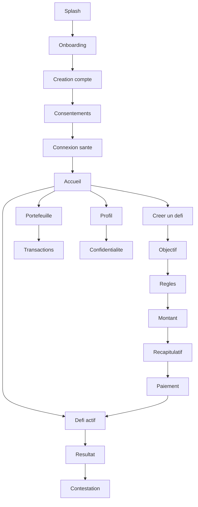
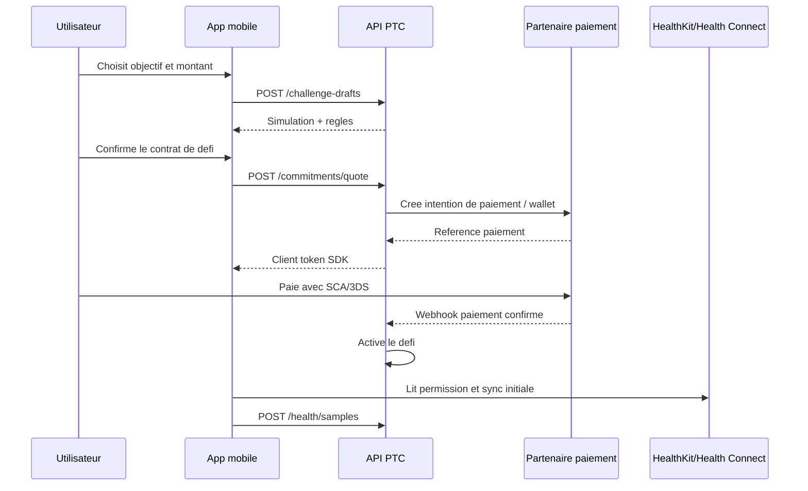
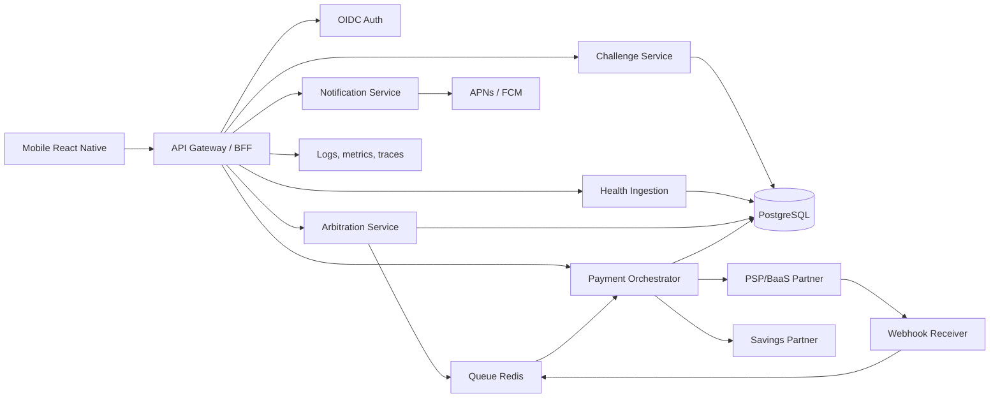
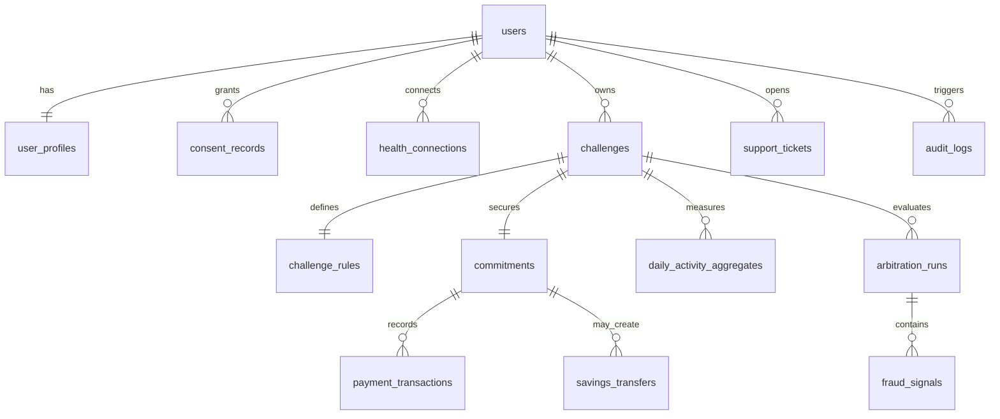

# Cahier de conception - PTC (Pay To Change)

Version: 0.1 conception  
Date: 2026-06-09  
Phase: cadrage produit, UX, architecture et specification avant developpement

## 1. Sources analysees

Documents fournis:

- `C:\Users\Armand\Downloads\LOGO,SLOGAN,NOM.docx`
  - Nom: `PAY TO CHANGE`
  - Slogan: `TOUTES LES EXCUSES ONT UN PRIX`
- `C:\Users\Armand\Downloads\FICHE DE CADRAGE v0.docx`
  - Application mobile de bien-etre et productivite basee sur la finance comportementale.
  - Objectif: MVP sur le marche francais sous 9 mois, securise reglementairement.
  - Priorite: qualite et conformite reglementaire.
  - Perimetre V1: objectifs, caution, paiement/sequestre, synchronisation sante, arbitrage anti-fraude, epargne automatisee.
  - Hors perimetre V1: reseau social, multi-placements, applications dediees objets connectes.
- `C:\Users\Armand\Downloads\Logo-PTC.png`
  - Logo: elephant metallique, cadenas, fond bleu nuit/noir, signature premium securisee.
  - Palette extraite:
    - Fond principal: `#020415`
    - Fond secondaire: `#080916`
    - Argent clair: `#E1E2E8`
    - Argent moyen: `#9A9DAD`
    - Acier: `#55596B`
    - Bleu cadenas/acier: `#69708E`
    - Bleu gris: `#7C829D`

Sources externes verifiees pour les decisions instables:

- Android: Google indique que les API Google Fit sont supportees jusqu'a fin 2026 et recommande Health Connect pour le suivi mobile des pas: https://developer.android.com/health-and-fitness/health-connect/migration/fit
- Apple: HealthKit impose une autorisation fine par type de donnee et une politique de confidentialite: https://developer.apple.com/documentation/healthkit/protecting-user-privacy
- CNIL: les applications mobiles de sante/bien-etre doivent limiter les donnees, informer clairement et recueillir un accord specifique quand des donnees de sante sont collectees: https://www.cnil.fr/fr/applications-mobiles-en-sante-et-protection-des-donnees-personnelles-les-questions-se-poser
- CNIL: recommandation 2024 sur les applications mobiles, permissions et transparence: https://www.cnil.fr/sites/cnil/files/2024-09/recommandation-applications-mobiles.pdf
- ACPR: fournir des services de paiement sans agrement ou mandat d'agent PSP est une infraction: https://acpr.banque-france.fr/sites/default/files/medias/documents/20230331_communique_acpr_mise_en_garde_fourniture_de_services_de_paiement_v0310.pdf
- Mangopay: wallets, KYC/KYB, payouts et contraintes de verification: https://docs.mangopay.com/guides/payouts
- Stripe Connect: segregation de fonds disponible en beta privee dans plusieurs pays dont la France: https://docs.stripe.com/connect/funds-segregation?locale=fr-FR

## 2. Reformulation produit

PTC est une application mobile d'engagement personnel. L'utilisateur choisit un objectif mesurable, depose une caution, autorise une source de verification, puis suit son avancement. Si l'objectif est atteint, la caution est restituee. Si l'objectif echoue, la somme n'est pas captee par PTC: elle est transferee ou bloquee vers une solution d'epargne partenaire definie a l'avance.

Positionnement recommande: "contrat personnel securise". Le produit doit motiver sans culpabiliser, proteger l'utilisateur contre les abus, et rendre chaque consequence claire avant paiement.

Decision structurante: PTC ne doit pas detenir les fonds, fournir directement un service de paiement, ni conseiller un placement. Les flux financiers, KYC, conservation des fonds et produit d'epargne doivent etre portes par un partenaire regule. PTC orchestre l'experience, les regles du defi et l'arbitrage applicatif.

## 3. Objectifs du MVP

Objectif principal: lancer en France un MVP fiable permettant a un utilisateur de creer un defi individuel, deposer une caution, connecter une source de preuve sante, suivre sa progression et obtenir une decision automatique auditable.

Objectifs secondaires:

- Valider l'appetence utilisateur pour l'engagement financier.
- Mesurer le taux de creation de defi apres onboarding.
- Valider la fiabilite des donnees HealthKit/Health Connect pour des objectifs simples.
- Valider le partenariat PSP/BaaS/epargne avant industrialisation.
- Construire une base technique compatible audit, RGPD, support client et montee en charge.

Indicateurs MVP:

- Activation: compte cree + consentements + source sante connectee.
- Conversion: premier defi cree et caution payee.
- Engagement: jours actifs pendant un defi.
- Qualite: taux de decisions contestees, taux d'echec de paiement, taux de sync sante.
- Conformite: zero detention directe de fonds par PTC, zero stockage de documents KYC, journal d'audit complet.

## 4. Utilisateurs et parties prenantes

Personas prioritaires:

- Utilisateur engage: veut tenir une resolution concrete et accepte une contrainte financiere.
- Utilisateur prudent: interesse mais inquiet de la securite de son argent et de ses donnees.
- Support PTC: traite les litiges, echecs de synchronisation, remboursements et questions de donnees.
- Administrateur conformite/operations: surveille flux, webhooks, arbitrages anormaux, incidents.

Partenaires:

- PSP/BaaS: sequestre/wallet, KYC, SCA, pay-in, refund/payout, webhooks.
- Partenaire epargne: produit financier par defaut, blocage/versement des sommes en cas d'echec.
- Plateformes sante: Apple HealthKit, Android Health Connect.

## 5. Perimetre fonctionnel

### 5.1 Fonctionnalites principales V1

1. Onboarding de confiance
   - Presentation courte du concept.
   - Explication claire: caution, succes, echec, transfert vers epargne.
   - Acceptation CGU, politique de confidentialite, consentement donnees sante separe des CGU.
   - Creation de compte.

2. Verification et paiement
   - Profil utilisateur minimal.
   - KYC delegue au partenaire si requis par le parcours financier.
   - Paiement de la caution via SDK ou lien securise partenaire.
   - Gestion SCA/3DS.
   - Statuts de paiement comprehensibles.

3. Creation de defi
   - Choix type d'objectif: pas quotidiens, distance, frequence d'activite.
   - Definition: valeur cible, duree, montant, regles de grace eventuelles.
   - Simulation avant validation: "si je reussis", "si j'echoue".
   - Recapitulatif contractuel avant paiement.

4. Connexion sante
   - iOS: HealthKit.
   - Android: Health Connect, pas Google Fit en nouvelle integration.
   - Lecture minimale: pas, distance, sessions selon objectifs.
   - Gestion refus/revocation permission.

5. Suivi et arbitrage
   - Tableau de bord du defi en cours.
   - Synchronisation quotidienne.
   - Score de progression.
   - Arbitrage automatique a la fin du defi.
   - Anti-fraude basique: coherence temporelle, valeurs extremes, trous de donnees, source non autorisee.

6. Resultat financier
   - Succes: restitution de la caution selon regles partenaire.
   - Echec: transfert/blocage vers produit epargne partenaire.
   - Trace complete des transactions et decisions.

7. Support et contestation
   - Historique des donnees retenues pour arbitrage.
   - Demande de revue manuelle.
   - Pieces/commentaires utilisateur.
   - Statuts de traitement.

8. Confidentialite et compte
   - Export des donnees.
   - Suppression de compte.
   - Gestion consentements.
   - Deconnexion source sante.
   - Historique transactions.

### 5.2 Fonctionnalites secondaires V1

- Notifications push: rappel quotidien, risque d'echec, paiement confirme, resultat.
- Mode brouillon: creation de defi sans paiement.
- FAQ embarquee.
- Limites de montant par utilisateur et par defi.
- Back-office operations minimal.

### 5.3 Hors perimetre V1

- Defis entre amis, reseau social, classement.
- Choix libre de supports d'investissement.
- Trading, crypto, actions.
- Apps dediees montres/objets connectes.
- Conseils financiers personnalises.
- Mode hors ligne complet pour les defis actifs.

## 6. Principes UX/UI

Principes:

- Confiance avant conversion: l'utilisateur doit comprendre les consequences avant paiement.
- Pas de dark pattern: aucune pression cachee, pas de montant piege, pas de consequence floue.
- Motivation ferme mais respectueuse: ton direct, jamais culpabilisant.
- Donnees explicables: montrer quelles donnees ont servi a arbitrer.
- Securite visible: badges de statut, traces, partenaire financier clairement identifie.
- Accessibilite: contrastes AA minimum, textes lisibles, parcours sans dependance a la couleur.

Identite visuelle:

- Theme principal: fond bleu nuit `#020415`.
- Surfaces: `#080916`, `#111525`, bordures `#333749`.
- Texte principal: `#F7F8FB`.
- Texte secondaire: `#B0B4C6`.
- Accent action: `#4C7DFF` pour les CTA, plus lisible que le bleu cadenas brut.
- Accent securite/premium: argent `#E1E2E8`.
- Succes: `#2FB67C`.
- Alerte: `#FFB020`.
- Erreur/echec: `#E5484D`.

Typographie:

- Mobile: SF Pro sur iOS, Roboto sur Android.
- Option design system: Inter pour coherence cross-platform si chargee en local.
- Titres: 24-30 pt, poids 700.
- Corps: 15-17 pt, poids 400/500.
- Microcopy finance/legal: 13-14 pt minimum.

Composants:

- Boutons: hauteur 48-52, rayon 8, icone + libelle quand action critique.
- Cartes: rayon 8 maximum, bordure acier subtile, pas de cartes imbriquees.
- Etats financiers: blocs sobres avec montant, statut, date, reference.
- Progression: anneau ou barre claire, accompagnee d'un texte numerique.
- Consentements: cases dediees, separees, non pre-cochees.

Usage logo:

- Splash screen: symbole + `PTC`.
- Fond sombre obligatoire ou variante monochrome claire a produire.
- Zone de protection: au moins la hauteur du cadenas autour du logo.
- Ne pas utiliser le logo complet comme decoration repetee.

## 7. Navigation et parcours utilisateurs

### 7.1 Arborescence mobile



### 7.2 Flow onboarding

1. Splash logo.
2. Ecran promesse: "Toutes les excuses ont un prix."
3. Ecran securite: argent gere par partenaire regule, donnees minimales, controle utilisateur.
4. Creation de compte.
5. Consentements:
   - CGU.
   - Politique de confidentialite.
   - Consentement donnees sante specifique.
   - Consentement notifications facultatif.
6. Connexion HealthKit/Health Connect.
7. Arrivee accueil.

### 7.3 Flow creation de defi



### 7.4 Flow arbitrage fin de defi

1. Job planifie declenche a la fin du defi.
2. Derniere synchronisation demandee a l'app si possible.
3. Service arbitrage calcule le resultat a partir des agregats journaliers.
4. Service anti-fraude ajoute un score et des signaux.
5. Si succes:
   - ordre de restitution via partenaire.
   - notification utilisateur.
6. Si echec:
   - ordre de transfert/blocage vers epargne partenaire.
   - notification utilisateur.
7. Si doute:
   - statut `manual_review`.
   - gel de l'action financiere jusqu'a decision support.

## 8. Maquettes fonctionnelles des ecrans

Les maquettes ci-dessous sont des wireframes textuels a transformer en design haute fidelite avant developpement UI.

### 8.1 Splash

- Fond `#020415`.
- Logo centre, version complete.
- Aucun texte additionnel sauf eventuel indicateur de chargement discret.

### 8.2 Onboarding - promesse

- Haut: logo compact.
- Titre: `Pay To Change`.
- Sous-titre: `Toutes les excuses ont un prix.`
- Visuel: cadenas/elephant ou detail metallique du logo.
- CTA primaire: `Commencer`.
- Lien secondaire: `Comment ca marche ?`.

### 8.3 Onboarding - fonctionnement

- Trois blocs:
  - `Fixe un objectif mesurable`
  - `Depose une caution`
  - `Reussis ou transforme l'echec en epargne`
- CTA: `Continuer`.
- Note courte: "PTC ne conserve pas ton argent: les flux passent par un partenaire financier."

### 8.4 Consentements

- Liste de consentements separes.
- Chaque ligne: titre, resume, lien detail, case.
- Le consentement donnees sante n'est pas fusionne avec les CGU.
- CTA inactif tant que les consentements obligatoires ne sont pas valides.

### 8.5 Connexion sante

- Etat iOS: HealthKit.
- Etat Android: Health Connect.
- Permissions expliquees par finalite.
- CTA: `Autoriser les donnees d'activite`.
- Alternative: `Plus tard`, mais creation de defi actif impossible sans source valide.

### 8.6 Accueil sans defi

- Bandeau montant potentiel "Pret a verrouiller ton prochain objectif ?"
- CTA principal: `Creer un defi`.
- Section education courte: dernier rappel securite.
- Acces portefeuille/profil en navigation basse.

### 8.7 Creation de defi - objectif

- Segmented control: `Pas`, `Distance`, `Activite`.
- Champs:
  - Objectif cible.
  - Frequence.
  - Duree.
  - Date de debut.
- Apercu dynamique de la regle.

### 8.8 Creation de defi - montant

- Slider + input montant.
- Limites visibles.
- Encadre:
  - `Si tu reussis: caution restituee.`
  - `Si tu echoues: montant transfere vers l'epargne partenaire.`
- Aucun bouton de paiement a ce stade.

### 8.9 Recapitulatif contractuel

- Resume objectif.
- Montant et frais eventuels.
- Source de verification.
- Conditions d'arbitrage.
- Consequence d'echec.
- Cases de confirmation explicites.
- CTA: `Valider et payer`.

### 8.10 Paiement

- SDK ou webview securisee du partenaire.
- Affichage statut: `Paiement en cours`, `Authentification requise`, `Confirme`, `Echec`.
- Retour app avec reference transaction.

### 8.11 Defi actif

- Header: nom du defi, jours restants.
- Progression: anneau + valeur actuelle.
- Carte caution: montant, statut `sequestre partenaire`.
- Timeline quotidienne: valide, incomplet, en attente de sync.
- CTA secondaire: `Synchroniser`.
- Lien: `Voir les donnees utilisees`.

### 8.12 Resultat

- Succes:
  - Message sobre.
  - Montant restitue, date estimee.
  - CTA: `Creer un nouveau defi`.
- Echec:
  - Message non culpabilisant.
  - Montant transfere/bloque en epargne.
  - Information partenaire.
  - CTA: `Voir le detail`.
- Doute:
  - `Verification manuelle en cours`.

### 8.13 Portefeuille

- Soldes et statuts provenant du partenaire, pas de solde invente cote PTC.
- Liste transactions:
  - pay-in caution.
  - refund.
  - transfert epargne.
  - frais.
- Detail transaction avec reference partenaire.

### 8.14 Profil et confidentialite

- Identite compte.
- Statut KYC.
- Source sante connectee.
- Consentements.
- Export donnees.
- Suppression compte.
- Deconnexion.

### 8.15 Back-office operations

- Recherche utilisateur/defi.
- Vue detail arbitrage.
- Webhooks financiers.
- Queue d'exceptions.
- Actions limitees et journalisees:
  - demander resync.
  - placer en revue manuelle.
  - confirmer decision manuelle.
  - ouvrir ticket support.

## 9. Architecture technique cible

Architecture recommandee: mobile native cross-platform + backend modulaire + integrations regulees.



Modules backend:

- `identity`: profil applicatif, statut auth, roles.
- `consent`: consentements, versions legales, historique.
- `challenge`: brouillons, defis, regles, etats.
- `health`: connexions, permissions, agregats journaliers.
- `arbitration`: calculs, signaux, decisions.
- `payment`: intents, transactions, webhooks, refunds/transfers.
- `savings`: ordre de versement/blocage partenaire.
- `notification`: push, emails transactionnels.
- `support`: tickets, contestations, revue manuelle.
- `audit`: journal d'evenements immuable.

## 10. Stack technique recommandee

### 10.1 Mobile

Choix: React Native + Expo Dev Client + TypeScript.

Justification:

- Un seul socle iOS/Android pour tenir le delai MVP.
- TypeScript partage les types avec API/OpenAPI.
- Expo Dev Client permet d'integrer des modules natifs HealthKit/Health Connect contrairement a une app Expo pure trop limitee.
- Ecosysteme solide pour navigation, formulaires, accessibilite et OTA controlee.

Bibliotheques:

- Navigation: React Navigation.
- Etat serveur: TanStack Query.
- Formulaires: React Hook Form + Zod.
- UI system: composants internes PTC, tokens de design, pas de kit generique visuellement dominant.
- Stockage local: SecureStore/Keychain/Keystore pour tokens, MMKV pour cache non sensible.
- Health:
  - iOS HealthKit via module natif maintenu ou wrapper interne.
  - Android Health Connect via module natif.
- Push: Expo Notifications ou integration native APNs/FCM selon build.

### 10.2 Backend

Choix: NestJS + TypeScript.

Justification:

- Architecture modulaire adaptee aux domaines fintech/sante.
- Validation DTO, guards, interceptors, OpenAPI natifs.
- Bon support jobs, queues, tests, injection de dependances.

Composants:

- API REST versionnee `/v1`.
- OpenAPI comme contrat front/back.
- Prisma ou TypeORM pour migrations; Prisma recommande pour vitesse et typage, avec discipline SQL pour contraintes critiques.
- PostgreSQL 16+.
- Redis + BullMQ pour jobs et webhooks.
- Stockage objet S3 compatible pour documents non sensibles support, avec chiffrement.
- Observabilite: OpenTelemetry, Sentry, logs structures.

### 10.3 Infrastructure

MVP:

- Region UE, idealement France ou UE proche.
- Environnements: dev, staging, production.
- CI/CD: GitHub Actions.
- Conteneurs: Docker.
- Deploiement: AWS ECS/Fargate, Scalingo, Clever Cloud, Fly.io EU, ou Kubernetes managé si equipe infra disponible.
- Secrets: AWS Secrets Manager, Doppler ou equivalent.
- Sauvegardes PostgreSQL chiffrees + tests de restauration.

Decision a valider: si les donnees traitees sont qualifiees donnees de sante au sens strict et que le contexte impose un hebergement specifique, choisir un hebergeur compatible HDS ou une architecture minimisant les donnees conservees cote PTC.

### 10.4 Partenaires financiers

Choix recommande pour cadrage: abstraction `FinancialProvider`, implementation pilote Mangopay ou BaaS equivalent.

Raison:

- Le modele wallet/sequestre/KYC/payout est plus proche du besoin que du paiement marchand simple.
- Stripe Connect reste une option mais la segregation de fonds est en beta privee selon documentation actuelle; a ne pas choisir sans confirmation contractuelle.
- Le partenaire doit porter les obligations PSP/BaaS, KYC, AML, SCA, conservation des fonds et execution des mouvements.

## 11. Modele de donnees

Principes:

- Ne pas stocker de donnees bancaires brutes.
- Ne pas stocker de documents KYC; conserver uniquement references et statuts partenaire.
- Stocker les donnees sante au niveau d'agregats necessaires a l'arbitrage.
- Chiffrer les champs sensibles.
- Journaliser tout evenement financier et toute decision.



Tables principales:

- `users`
  - `id`, `auth_provider_id`, `email_hash`, `phone_hash`, `status`, `role`, `created_at`, `updated_at`.
- `user_profiles`
  - `user_id`, `display_name`, `country`, `locale`, `timezone`, `kyc_status`, `financial_provider_user_id`.
- `consent_records`
  - `id`, `user_id`, `type`, `version`, `granted`, `granted_at`, `revoked_at`, `ip_hash`, `user_agent_hash`.
- `health_connections`
  - `id`, `user_id`, `platform`, `status`, `permissions`, `last_sync_at`, `revoked_at`.
- `challenges`
  - `id`, `user_id`, `title`, `type`, `status`, `start_at`, `end_at`, `timezone`, `created_at`.
- `challenge_rules`
  - `challenge_id`, `metric`, `target_value`, `frequency`, `grace_days`, `source_policy`, `arbitration_policy_version`.
- `commitments`
  - `id`, `challenge_id`, `amount_cents`, `currency`, `status`, `provider`, `provider_wallet_id`, `provider_payment_id`, `terms_version`.
- `daily_activity_aggregates`
  - `id`, `challenge_id`, `date`, `metric`, `value`, `source`, `confidence_score`, `synced_at`.
- `arbitration_runs`
  - `id`, `challenge_id`, `status`, `result`, `score`, `policy_version`, `computed_at`, `review_required`, `explanation_json`.
- `fraud_signals`
  - `id`, `arbitration_run_id`, `type`, `severity`, `details_json`.
- `payment_transactions`
  - `id`, `commitment_id`, `type`, `status`, `amount_cents`, `currency`, `provider_ref`, `idempotency_key`, `created_at`.
- `savings_transfers`
  - `id`, `commitment_id`, `status`, `amount_cents`, `partner_ref`, `executed_at`.
- `support_tickets`
  - `id`, `user_id`, `challenge_id`, `type`, `status`, `message`, `created_at`, `resolved_at`.
- `audit_logs`
  - `id`, `actor_type`, `actor_id`, `event_type`, `entity_type`, `entity_id`, `payload_hash`, `created_at`.

## 12. API et interactions front/back

Style: REST JSON versionne + OpenAPI + idempotency keys sur toutes les actions financieres.

Endpoints principaux:

| Domaine | Methode | Endpoint | Usage |
|---|---:|---|---|
| Session | GET | `/v1/me` | Profil courant, statuts KYC/consentements |
| Consentements | GET | `/v1/legal-documents/current` | Versions CGU/privacy/health |
| Consentements | POST | `/v1/consents` | Enregistrer un consentement |
| Sante | POST | `/v1/health/connections` | Declarer une connexion HealthKit/Health Connect |
| Sante | POST | `/v1/health/samples:sync` | Envoyer agregats necessaires |
| Defis | POST | `/v1/challenge-drafts` | Creer/simuler un brouillon |
| Defis | POST | `/v1/challenges` | Confirmer un defi |
| Defis | GET | `/v1/challenges` | Liste defis |
| Defis | GET | `/v1/challenges/{id}` | Detail defi actif |
| Paiement | POST | `/v1/commitments/quote` | Obtenir montant/frais/regles |
| Paiement | POST | `/v1/commitments/{id}/payment-intent` | Creer intention paiement |
| Paiement | POST | `/v1/webhooks/financial-provider` | Webhooks PSP/BaaS |
| Arbitrage | GET | `/v1/challenges/{id}/arbitration` | Resultat et justification |
| Support | POST | `/v1/challenges/{id}/disputes` | Contestation |
| Portefeuille | GET | `/v1/wallet/transactions` | Historique transactions |
| Privacy | POST | `/v1/privacy/export` | Export donnees |
| Privacy | DELETE | `/v1/account` | Suppression compte |

Regles API:

- Auth obligatoire par JWT/OIDC.
- Autorisation par ownership stricte.
- Idempotence obligatoire: paiement, refund, transfert epargne, webhook.
- Webhooks verifies par signature.
- Reponses d'erreur normalisees: `code`, `message`, `correlationId`.
- Aucune cle PSP ni secret Health dans l'app mobile.

## 13. Arbitrage et anti-fraude

Politique V1:

- L'utilisateur sait avant paiement quelles donnees seront utilisees.
- L'arbitrage repose sur agregats journaliers.
- Les jours sans permission ou sans sync sont traites selon une regle annoncee.
- Toute decision est reconstructible par `policy_version`.

Signaux anti-fraude V1:

- Pas quotidiens extremement eleves.
- Sauts brutaux entre jours.
- Donnees arrivees apres la fin du defi.
- Source non attendue ou permission revoquee.
- Incoherence entre distance et pas si les deux existent.

Sorties:

- `passed`: objectif atteint.
- `failed`: objectif non atteint.
- `manual_review`: signaux ou donnees insuffisantes.

Important: l'anti-fraude V1 doit rester proportionne. Eviter geolocalisation permanente, collecte intrusive ou surveillance continue non necessaire.

## 14. Securite, conformite et confidentialite

Mesures de base:

- OAuth/OIDC, tokens courts, refresh tokens securises.
- MFA/passkeys a prevoir.
- Chiffrement TLS partout.
- Chiffrement au repos pour base et backups.
- Chiffrement applicatif des champs sensibles.
- Rate limiting, detection brute force.
- Webhooks signes et idempotents.
- RBAC back-office.
- Journal d'audit non modifiable par les utilisateurs support.
- Tests SAST/DAST/dependances en CI.
- Pentest avant production.

RGPD:

- Privacy by design.
- Minimisation des donnees sante.
- Consentement sante separe, libre, specifique, eclaire et univoque.
- Politique de confidentialite accessible avant traitement.
- Export et suppression.
- Durees de conservation:
  - Compte actif: donnees utiles au service.
  - Apres suppression: anonymisation/suppression sauf obligations legales/audit financier.
  - Agregats sante: supprimer a la fin du besoin operationnel et support.
- DPIA recommande avant lancement.

Finance:

- PTC ne manipule pas directement les fonds.
- Le partenaire PSP/BaaS execute pay-in, sequestre/wallet, refund, payout/transfert.
- Conditions contractuelles utilisateur synchronisees avec le partenaire.
- Revue juridique obligatoire sur:
  - qualification du sequestre,
  - statut d'agent PSP eventuel,
  - produit d'epargne,
  - communication marketing,
  - frais et remuneration PTC.

## 15. Structure projet recommandee

Arborescence cible:

```text
ptc/
  apps/
    mobile/
      src/
        app/
        features/
        shared/
        design-system/
        health/
        financial/
      ios/
      android/
    api/
      src/
        modules/
          identity/
          consent/
          challenge/
          health/
          arbitration/
          payment/
          savings/
          notification/
          support/
          audit/
        common/
        config/
      prisma/
      test/
    admin/
      src/
  packages/
    contracts/
      openapi/
      schemas/
    config/
    eslint-config/
    tsconfig/
  infra/
    docker/
    terraform/
  docs/
    cahier_de_conception_ptc.md
    api/
    security/
    product/
```

Monorepo recommande: pnpm workspaces + Turborepo.

## 16. Plan de realisation sur 9 mois

Phase 0 - validation reglementaire (2 a 4 semaines)

- Choisir PSP/BaaS et partenaire epargne.
- Obtenir avis juridique.
- Cadrer CGU, privacy, DPIA.
- Valider modele financier.

Phase 1 - prototype UX et architecture (4 semaines)

- Design system haute fidelite.
- Prototype Figma des parcours critiques.
- OpenAPI initial.
- POC HealthKit/Health Connect.
- POC paiement sandbox.

Phase 2 - MVP core (8 a 10 semaines)

- Auth, consentements, profil.
- Creation defi.
- Paiement sandbox.
- Synchronisation sante.
- Dashboard defi actif.

Phase 3 - arbitrage et flux financiers (6 a 8 semaines)

- Moteur arbitrage.
- Webhooks financiers.
- Refund/transfert epargne sandbox.
- Notifications.
- Journal audit.

Phase 4 - back-office, support, conformite (4 a 6 semaines)

- Console operations.
- Contestations.
- Export/suppression donnees.
- Monitoring.
- Documentation support.

Phase 5 - beta fermee et durcissement (6 a 8 semaines)

- Tests utilisateurs.
- Tests charge.
- Pentest.
- Correction accessibilite.
- App Store / Play Store precheck.

Phase 6 - lancement MVP France (2 a 4 semaines)

- Production progressive.
- Monitoring renforce.
- Support live.
- Revue metriques.

## 17. Criteres d'acceptation MVP

- Un utilisateur peut creer un compte et consentir separement aux traitements.
- Un utilisateur peut connecter HealthKit ou Health Connect.
- Un utilisateur peut creer un defi simple avec caution.
- La caution est traitee par partenaire financier en sandbox puis production.
- Le defi affiche une progression quotidienne.
- L'arbitrage final est explicable.
- Les resultats declenchent refund ou transfert epargne via partenaire.
- Les webhooks financiers sont idempotents et audites.
- Le support peut traiter une contestation.
- L'utilisateur peut exporter/supprimer ses donnees.
- Les parcours critiques passent tests automatises et tests manuels.
- Aucune donnee bancaire brute ni document KYC n'est stocke par PTC.

## 18. Risques et parades

| Risque | Impact | Parade |
|---|---:|---|
| Qualification reglementaire mal cadree | Critique | Partenaire regule + avis juridique avant dev financier |
| Google Fit non perenne | Eleve | Choisir Health Connect directement |
| Donnees sante trop intrusives | Eleve | Agregats minimaux, consentement separe, DPIA |
| Fraude aux pas | Moyen | Signaux basiques + revue manuelle + objectifs simples V1 |
| Webhooks paiement dupliques ou retardes | Eleve | Idempotence + machine d'etat + reconciliation jobs |
| Litiges utilisateur | Eleve | Recap contractuel clair + detail arbitrage + support |
| Rejet stores | Moyen | Respect guidelines HealthKit/Health Connect, privacy claire |
| Delai 9 mois tendu | Moyen | Limiter V1 aux defis individuels simples |

## 19. Decisions a valider avant developpement

1. Partenaire financier principal: Mangopay, Stripe Connect avec acces beta, ou autre BaaS.
2. Nature exacte du produit d'epargne partenaire et propriete des fonds apres echec.
3. Montants min/max des cautions.
4. Regles de grace: jours joker, retard de synchronisation, contestation.
5. Statut KYC: obligatoire avant premier paiement ou seulement au-dessus d'un seuil partenaire.
6. Modele economique: abonnement, frais de service, commission partenaire, autre.
7. Niveau d'hebergement attendu pour les donnees sante/bien-etre.
8. Pays MVP: France uniquement confirme.

## 20. Recommandation finale

La meilleure strategie est de construire d'abord un MVP strict, individuel et juridiquement robuste:

- objectifs simples et mesurables;
- Health Connect/HealthKit uniquement;
- partenaire financier responsable des fonds;
- donnees minimales et consentements propres;
- arbitrage explicable;
- design premium sombre/metallique, mais tres lisible;
- back-office operationnel des la V1.

La promesse PTC est forte. Le succes dependra moins de la complexite fonctionnelle que de la confiance: l'utilisateur doit savoir exactement ce qu'il risque, pourquoi la decision est prise, ou va son argent, et comment il garde le controle de ses donnees.
